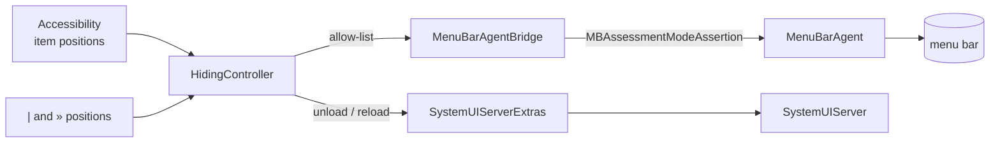

# MenuHider

**English** | [简体中文](README.zh-CN.md)

<p align="center">
  
</p>

[](#installation)
[](#development)
[](LICENSE)

[](https://github.com/SkyCTing/menu-hider/releases/latest)
[](https://github.com/SkyCTing/menu-hider/stargazers)
[](https://github.com/SkyCTing/menu-hider/issues)

MenuHider hides third-party menu bar icons on macOS 27, where Hidden Bar, Ice and most other
managers stopped working.

One marker divides your menu bar into two hidden zones. Click `»` for the icons between `|` and
`»`; two-finger tap `»` for the ones left of `|` while the bar is expanded. A click always steps
back towards the bare bar, so the left zone is on screen only because you just asked for it. Both
fold away after the auto-hide timer, and hold ⌘ to drag either marker. On a bare bar a two-finger
tap opens the menu instead.

```
  both hidden                              «    [always visible]
  » clicked             |  [right zone]  ‹    [always visible]
  » two-finger tap      [left zone]  |   ›    [always visible]
  both revealed         [left zone]  |  [right zone]  »    [always visible]
```

No Screen Recording permission, no screenshots of your menu bar, no telemetry. Accessibility is
the only permission it asks for, and the one request it makes is a daily update check, which can be
switched off.

## Features

- **Two zones, one switch.** Click `»` for the icons between `|` and `»` — the ones you want now
  and then. Two-finger tap `»` for the icons left of `|` — the ones you almost never need, and the
  ones you drag in while it is open. The `|` itself is on screen only while a zone is open.
- **A click always takes you back.** Clicking `»` hides the left zone as well, whatever state it
  was in, so a peeked left zone can never be left stranded on the bar.
- **The two-finger tap knows where it is.** While anything is on screen it toggles the far zone;
  on a bare bar there is nothing to peek at, so it opens the menu instead and the everyday
  right-click habit keeps working. ⌃-click opens the menu in any state, and each zone has its own
  checkmark there, plus *Show Both Zones* for rearranging — which is also how a mouse reaches the
  left zone.
- **Icons right of the switch are never hidden.** Park the ones you always want to see right of
  `»` and they stay on screen whether the zones are open or folded away.
- **Auto-hide timer.** Never, 5 seconds, 10 seconds, 30 seconds or 1 minute — 10 seconds by default.
- **Apple menu extras hide too.** Time Machine, VPN and the other `SystemUIServer` extras are
  unloaded with the zone they sit in and loaded back when that zone is revealed.
- **Rescan Layout.** Re-reads which icons sit in each zone, so reordering icons while everything is
  revealed just works.
- **Update check.** Once a day it asks GitHub whether a newer release exists and offers to download
  it. Nothing about you is sent, and it can be turned off from the menu.
- **English and 简体中文.** The menu picks the language, and the change lands immediately — no
  relaunch. *Follow System* is the default, so macOS's own per-app language setting works too.
- **Launch at Login.** Registers with `SMAppService`.
- **Minimal footprint.** Accessibility permission only — no Screen Recording, no screenshots of
  your menu bar, no telemetry.

MenuHider lives in the menu bar with no Dock icon, and hiding an icon does not quit its app.

## Installation

Download `MenuHider-x.y.z.dmg` from [Releases](https://github.com/SkyCTing/menu-hider/releases/latest),
open it and drag **MenuHider** onto the Applications shortcut beside it. A `.zip` is attached as
well: that is the copy the built-in update check downloads for you.

The build is ad-hoc signed rather than notarized, so the first launch needs a right click → *Open*
in Finder, or *System Settings → Privacy & Security → Open Anyway*. macOS ties the Accessibility
grant to the signature, so an update asks for it again — re-granting takes a second, but the stale
entry may need removing with the − button first.

**Requires macOS 27.** The app also builds and launches on macOS 26, but hiding needs 27 — below
that the menu reports *Hiding unavailable on this macOS build* and nothing else changes.

[Releases](https://github.com/SkyCTing/menu-hider/releases) · [Report an issue](https://github.com/SkyCTing/menu-hider/issues)

### Build from source

Needs Xcode 26.3 or newer, [xcodegen](https://github.com/yonaskolb/XcodeGen), and — for the
installer image only — [create-dmg](https://github.com/create-dmg/create-dmg) (`brew install create-dmg`).

```bash
brew install xcodegen
git clone https://github.com/SkyCTing/menu-hider.git
cd menu-hider
make install        # builds Release, copies to /Applications, launches
```

The default build is ad-hoc signed, which works everywhere but has one drawback: every rebuild
produces a new signature and macOS forgets the Accessibility grant. If you have an Apple developer
certificate, sign with it so the grant survives rebuilds:

```bash
make install SIGN_IDENTITY="Developer ID Application" TEAM=XXXXXXXXXX
# or put those two lines into local.mk (git-ignored) once
```

## Usage

On first launch, allow MenuHider in **System Settings → Privacy & Security → Accessibility**.
It asks once and then checks every two seconds, so hiding starts as soon as you grant it — no
restart. If you dismissed the prompt, ⌃-click `»` and choose *Open Accessibility Settings…*.

1. Click `»` to reveal the icons, then ⌘-drag `|` and `»` to the two cuts you want: icons between
   them are the right zone, icons left of `|` are the left zone.
2. Click `»` for the right zone, two-finger tap `»` for the left zone while something is on
   screen, or wait for the auto-hide timer, which folds both away.
3. To move an icon into a zone, open it — or pick *Show Both Zones* to see the whole bar at once —
   ⌘-drag the icon across the line, then *Rescan Layout*.
4. `»` itself is never hidden, so you can always click it back open, and a click never leaves the
   left zone behind.

**⌃-click** `»` or `|` for the menu in any state, or two-finger tap a bare bar:

| Item | What it does |
|---|---|
| Status line | *All items visible* or *Hiding N apps (left zone + right zone)*; a warning when the permission is missing, the private framework is gone, or a call failed |
| Open Accessibility Settings… | Only while the grant is missing |
| Show Left Zone | Same as a two-finger tap while the bar is expanded, and the only way there with a mouse |
| Show Right Zone | Same as a click on `»` |
| Show Both Zones | Every icon on the bar at once |
| Rescan Layout | Re-read which icons sit in each zone |
| Download MenuHider x.y.z… | Only while a newer release is known; downloads it to your Downloads folder |
| Check for Updates | Asks now instead of waiting for the daily check |
| Check for Updates Automatically | The daily check itself, on by default |
| Language | Follow System, English or 简体中文 — applied at once |
| Auto-hide After | Never, 5 seconds, 10 seconds, 30 seconds, 1 minute (10 seconds by default) |
| Launch at Login | Registers with `SMAppService` |
| About MenuHider | Opens the repository |
| Quit MenuHider | ⌘Q |

The zones are recomputed whenever the whole bar is on screen — which is also the only time the
icons' positions can be read. Reordering icons while everything is revealed, or pressing *Rescan
Layout*, picks the change up; collapsing from a half-revealed bar reuses the last reading. Apps
launched while a zone is collapsed stay visible until you move them into a zone.

The interface follows your system language unless you pick one under *Language*; that choice is
remembered, and it applies to the next time the menu opens rather than at the next launch.

## Updates

Once a day — at launch if a day has gone by, and every 24 hours while it runs — MenuHider asks
`api.github.com` for the newest release. Nothing about you is sent, no identifier is included, and
*Check for Updates Automatically* turns the whole thing off.

When a newer release turns up, the menu offers *Download MenuHider x.y.z…*, and the first time it is
seen an alert says the same. Downloading puts a copy in your Downloads folder after checking that it
is this app, that it is the version the release claims, and that its signature is intact: the
archive is unpacked with `ditto`, which keeps the signature readable, and checked with
`codesign --verify --strict` — never `spctl`, because an ad-hoc build fails Gatekeeper assessment by
design and asking it would reject legitimate updates.

These builds are not notarized, so **nothing can prove who published the download**: those checks
prove it has not changed since it was signed, not that we signed it. That is why MenuHider never
replaces its own bundle. It marks the download as coming from the internet, exactly as a browser
would, and leaves the OS's own confirmation and the drag into Applications to you.

Opening the new version asks for the Accessibility permission again, because macOS ties the grant to
the signature and every build has a different one.

## How it works



- **Hiding.** `MenuBarAgent` exposes a visibility restriction: *"show only these system items and
  these bundle identifiers"*. Its client lives in the private `MenuBarClientCore.framework` as
  `MBAssessmentModeAssertion`, and it is the one service there that needs no entitlement. The app
  loads the framework with `dlopen`, builds an allow-list of every running app minus the hidden
  ones, and activates the assertion. Releasing it restores the bar instantly.
- **Which icons.** Positions of third-party items come from each app's `AXExtrasMenuBar`; the two
  markers are the app's own `NSStatusItem`s, and an item is hidden when its x falls left of `|` or
  between `|` and `»`. Only positions read from the markers' own bar are used, since Accessibility
  reports an item's position for whichever display's bar was laid out last. An app with an icon
  right of `»` is never hidden, whatever else that app has in a zone. The scan runs concurrently
  across apps and takes about 100 ms.
- **When the zones are read.** Positions only exist while the icons are on screen, and the
  restriction takes them away, so the zones are recomputed on the way out of a fully revealed bar
  (and by *Rescan Layout*, which reveals everything for half a second). Collapsing one zone while
  the other is still open reuses the previous reading.
- **Apple menu extras.** They are plugins loaded into `SystemUIServer`, and `MenuBarAgent`
  attributes all of them to that one bundle identifier, so the allow-list cannot hide one without
  the others. Instead the app unloads each extra that sits in a collapsed zone through the
  private `CoreMenuExtra` functions in `ApplicationServices` — `CoreMenuExtraGetMenuExtra`,
  `CoreMenuExtraAddMenuExtra`, `CoreMenuExtraRemoveMenuExtra` — and loads it back when that zone is
  revealed. Those calls expose no identifiers, only a handle whose value is the load order, so the
  extras are told apart by that order and matched positionally against the AX children of
  `SystemUIServer`.
- **Degradation.** If Apple removes the framework or the class, the menu says *Hiding unavailable
  on this macOS build* and nothing else changes.

### The Notification Center catch

The restriction is what macOS uses for exam (assessment) mode, and that mode deliberately blocks
Notification Center. With the restriction active a click on the clock does nothing:
BetterTouchTool has exactly this bug open. MenuHider lifts the restriction while the pointer
hovers the clock and puts it back half a second after the pointer leaves. An already-open panel
survives the restriction, so widgets keep working; the price is that hidden icons show while the
cursor sits on the clock.

This is the price of the mechanism, and the zones make it visible more often: with one zone open
and the other hidden the restriction is still in force, so the clock and Control Center panels
need the pointer to rest on the clock first. With both zones revealed nothing is restricted and the
panels behave normally. Hidden Bar never had this problem because it never touched the restriction
— it hid icons by inflating a status item's length until they were pushed off screen, which is
exactly what macOS 27 stopped honouring.

## Notes

- Private API. Apple can close it in any 27.x update; the app reports it instead of crashing, but
  hiding will stop until a workaround exists.
- **Only third-party apps can be hidden.** The scan skips daemons and every `com.apple.*` process,
  so Apple's own status items stay put even when they sit in a zone.
- **System items are never hidden.** Battery, Bluetooth, clock, volume, Wi-Fi, display mirroring,
  keyboard, Control Center and the other Apple agents are hard-coded into the allow-list.
- **The left zone needs a two-finger tap**, which needs *System Settings → Trackpad → Secondary
  click*. With a mouse, or with that gesture turned off, the context menu's *Show Left Zone* is the
  way in.
- **Hiding is per app, not per icon.** The restriction takes bundle identifiers, so an app with one
  icon in the left zone and another in the right one hides as a whole until *both* zones are
  revealed. Only an icon right of `»` saves the app: that side wins, and its icon in a zone then
  shows too. Keep every icon of an app on the same side.
- A status item whose process has no bundle identifier cannot be allow-listed and stays hidden
  whenever a zone it is in is collapsed.
- **Known issue.** A collapsed Apple menu extra is really unloaded, so System Settings shows it as
  off until its zone is revealed. The app reloads it on quit and on the next launch after a crash;
  if you delete the app while a zone is collapsed, turn the extra back on in System Settings.
- **Multi-display.** Every icon is drawn on every display's menu bar, but Accessibility reports
  each position from only one bar at a time, so the zones are read from the display the markers sit
  on and icons whose positions belong to another display's bar are left visible. Move the markers to
  another display and the next scan reads that display's bar instead.

## Development

```bash
make gen      # xcodegen generate (project.pbxproj is not committed)
make test     # unit tests for the pure logic
make lint     # swiftlint + swift-format, configs are in the repo
make build    # Release build into build/
make run      # build and launch from build/
make install  # build, copy to /Applications, launch
make release VERSION=1.0.0 NOTE="what changed"   # version → package → commit → tag → push → Release
```

### Adding a language

The interface strings live in `MenuHider/Resources/<language>.lproj/Localizable.strings` and are
declared once in `Text` (`MenuHider/Models/Strings.swift`), so a missing translation is a failing
test rather than a blank label. One language takes three things:

1. `MenuHider/Resources/<language>.lproj/Localizable.strings` — copy an existing table and translate
   the values. Keys are checked against `Text.allCases`, and placeholders (`%d`, `%@`) are compared
   across tables, so a dropped one fails the build.
2. A case in `Language` with its own `.lproj` name and its own name in itself.
3. A `README.<language>.md`, linked from the language line at the top of every other README.

## Feedback

Use [Issues](https://github.com/SkyCTing/menu-hider/issues) to report problems or suggest
improvements. For hiding problems, include your macOS version, MenuHider version, which icons were
involved and the steps to reproduce. A screenshot or short recording helps.

## License

[MIT](LICENSE)
