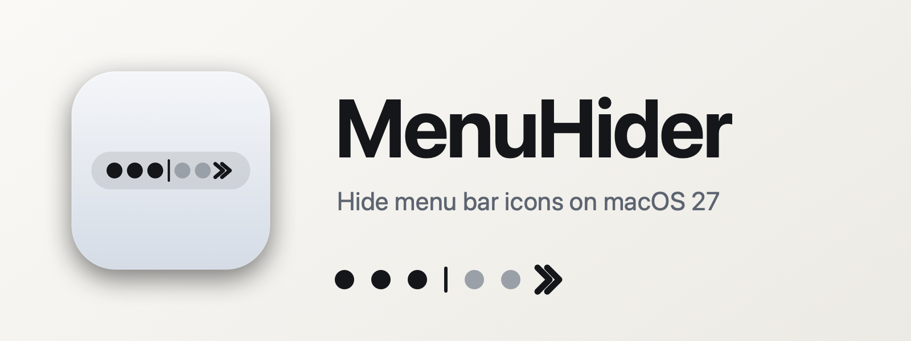
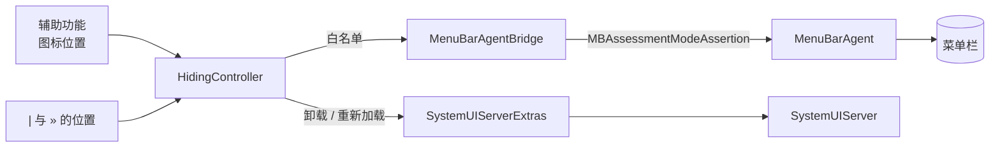

# MenuHider

[English](README.md) | **简体中文**

<p align="center">
  
</p>

[](#安装)
[](#开发)
[](LICENSE)

[](https://github.com/SkyCTing/menu-hider/releases/latest)
[](https://github.com/SkyCTing/menu-hider/stargazers)
[](https://github.com/SkyCTing/menu-hider/issues)

MenuHider 在 macOS 27 上隐藏第三方菜单栏图标 —— 在系统重写菜单栏之后，Hidden Bar、Ice 和大多数同类工具都已失效。

菜单栏被一个标记切成两块隐藏区。单击 `»` 展开 `|` 与 `»` 之间的图标；**展开之后**双指点击 `»` 展开 `|` 左边的图标。**单击永远是把菜单栏收回干净状态的一步**，所以左区只会因为你刚点名要看它才出现在屏幕上。两块都按自动隐藏计时器收起，按住 ⌘ 可以拖动任一标记。菜单栏全收起时双指点击是打开菜单。

```
  全部收起                                «   [始终可见]
  单击 »            |  [右区]   ‹   [始终可见]
  双指点击 »        [左区]  |   ›   [始终可见]
  全部展开          [左区]  |  [右区]  »   [始终可见]
```

不需要屏幕录制权限，不截取你的菜单栏，也没有任何遥测。只申请辅助功能权限。

## 功能

- **两块区，一个开关**：单击 `»` 展开"偶尔要看"的那组（`|` 与 `»` 之间），双指点击 `»` 展开"几乎不看"的那组（`|` 左边）—— 也是你往里拖图标时先打开的那块。`|` 只在有区展开时才出现在菜单栏上。
- **单击永远把左区一并收回**：不管当前是什么状态，点了 `»` 之后左区不会单独留在屏幕上，所以它不会像常驻图标那样赖着不走。
- **双指知道自己在什么状态**：屏幕上已经露出东西时，双指左右两个标记都是切换左区；菜单栏干干净净的时候没什么可偷看的，双指就打开菜单 —— 你原来的右键习惯照旧。⌃＋单击在任何状态下都能出菜单；菜单里两块区各有一个勾选项，另加 *Show Both Zones* 方便整理布局，鼠标用户也是从那里进左区。
- **`»` 右边的图标永远不会被隐藏**：把必须常驻的图标拖到 `»` 右侧，无论展开还是收起它们都在。
- **自动隐藏**：永不、5 秒、10 秒、30 秒或 1 分钟，默认为 10 秒。
- **Apple 菜单附加项同样隐藏**：Time Machine、VPN 等 `SystemUIServer` 附加项会随后它所在的那块区一起卸载，该区展开时再加载回来。
- **重新扫描布局**：重新读取两块区里的图标，因此全部展开时调整图标顺序也能生效。
- **登录时启动**：通过 `SMAppService` 注册。
- **干净**：只申请辅助功能权限 —— 不录屏、不截取菜单栏、无遥测。

MenuHider 常驻菜单栏，不显示 Dock 图标；隐藏图标不会退出对应的应用。

## 安装

从 [Releases](https://github.com/SkyCTing/menu-hider/releases/latest) 下载 `MenuHider-x.y.z.zip`，解压后将 **MenuHider.app** 拖入 **应用程序** 文件夹。

发布版本是 ad-hoc 签名、未公证，所以首次打开需要在访达里右键 → *打开*（或到 *系统设置 → 隐私与安全性* 里选"仍要打开"）。macOS 把辅助功能授权绑在签名上，因此**每次更新后都要重新授权一次** —— 重新授权只要一秒，但如果列表里那条还亮着却无效，先用减号移除再加回来。

**需要 macOS 27。** 在 macOS 26 上也能编译和启动，但隐藏功能需要 27 —— 更低版本上菜单会显示 *Hiding unavailable on this macOS build*，除此之外没有任何影响。

[发布版本](https://github.com/SkyCTing/menu-hider/releases) · [问题反馈](https://github.com/SkyCTing/menu-hider/issues)

### 从源码构建

需要 Xcode 26.3 或更高版本，以及 [xcodegen](https://github.com/yonaskolb/XcodeGen)。

```bash
brew install xcodegen
git clone https://github.com/SkyCTing/menu-hider.git
cd menu-hider
make install        # 编译 Release，复制到 /Applications 并启动
```

默认构建使用 ad-hoc 签名，任何机器都能跑，但有一个代价：每次重新编译都会产生新签名，macOS 会忘记辅助功能授权。如果你有 Apple 开发者证书，用它签名就能让授权在重新编译后保留：

```bash
make install SIGN_IDENTITY="Developer ID Application" TEAM=XXXXXXXXXX
# 或者把这两行写进 local.mk（已被 git 忽略）一次性配置好
```

## 使用

首次启动时，在 **系统设置 → 隐私与安全性 → 辅助功能** 中允许 MenuHider。它只弹一次授权请求，之后每两秒检查一次，授权到位即开始工作，无需重启。如果你关掉了授权弹窗，⌃＋单击 `»`，选择 *Open Accessibility Settings…* 即可继续。

1. 单击 `»` 展开图标，然后按住 ⌘ 拖动 `|` 和 `»` 到你想要的两条切线：夹在两者之间的是右区，`|` 左边的是左区。
2. 单击 `»` 展开右区；屏幕上已经露出东西时双指点击 `»` 展开左区（全收起时双指是出菜单）；或者等自动隐藏把两块一起收起来。
3. 想把某个图标挪进某块区：先把那块区打开（或点菜单里的 *Show Both Zones* 一次把整条菜单栏都露出来），⌘ 拖动图标越过切线，再点 *Rescan Layout*。
4. `»` 自身永远不会被隐藏，所以随时都能点回来；单击也不会把左区单独留下。

**⌃＋单击** `»` 或 `|` 在任何状态下都能打开菜单；全收起时双指点击也行：

| 菜单项 | 作用 |
|---|---|
| 状态行 | *All items visible* 或 *Hiding N apps (left zone + right zone)*；缺少权限、私有框架被移除或调用失败时会显示警告 |
| Open Accessibility Settings… | 仅在缺少授权时出现 |
| Show Left Zone | 等同于展开状态下的双指点击；也是鼠标用户进左区的唯一入口 |
| Show Right Zone | 等同于单击 `»` |
| Show Both Zones | 一次把所有图标都露出来 |
| Rescan Layout | 重新读取两块区里的图标 |
| Auto-hide After | 永不、5 秒、10 秒、30 秒、1 分钟（默认 10 秒） |
| Launch at Login | 通过 `SMAppService` 注册 |
| About MenuHider | 打开仓库页面 |
| Quit MenuHider | ⌘Q |

只要整个菜单栏都在屏幕上就会重算两块区 —— 那也正是唯一能读到图标位置的时候。全部展开时调整图标顺序、或点 *Rescan Layout*，改动都会被读进去；从"只展开一半"的状态收起则沿用上一次的读数。某块区收起期间新启动的应用会保持可见，直到你把它拖进某块区。

## 工作原理



- **隐藏机制**：`MenuBarAgent` 暴露了一个可见性限制服务 —— *“只显示这些系统项和这些 bundle identifier”*。它的客户端位于私有框架 `MenuBarClientCore.framework` 中，类名是 `MBAssessmentModeAssertion`，也是其中唯一不需要任何 entitlement 的服务。应用用 `dlopen` 加载该框架，构造一份“所有运行中的应用减去被隐藏的应用”的白名单并激活断言；释放断言即可立即恢复菜单栏。
- **哪些图标**：第三方图标的位置来自各应用自己的 `AXExtrasMenuBar`；两个标记都是本应用自己的 `NSStatusItem`。图标的 x 落在 `|` 左侧、或落在 `|` 与 `»` 之间，就会被隐藏；只要某应用有一个图标落在 `»` 右侧，它就完全不会被隐藏。只有读自**标记所在那块菜单栏**的位置才算数 —— 辅助功能报的是"最后一块完成布局的屏幕"的坐标。扫描在所有应用间并发执行，耗时约 100 ms。
- **什么时候读位置**：图标只有在屏幕上才读得到坐标，而限制本身会把它们拿走，所以两块区是在"整个菜单栏全部展开"退出时重算的（*Rescan Layout* 则是先把全部图标露出来半秒再读）。一块区展开、另一块收起时再收起，会沿用上一次的读数。
- **Apple 菜单附加项**：它们是加载进 `SystemUIServer` 的插件，而 `MenuBarAgent` 把它们全部归到同一个 bundle identifier 上，所以白名单无法单独隐藏其中一个。因此应用改为通过 `ApplicationServices` 里的私有 `CoreMenuExtra` 函数 —— `CoreMenuExtraGetMenuExtra`、`CoreMenuExtraAddMenuExtra`、`CoreMenuExtraRemoveMenuExtra` —— 把落在收起区里的附加项卸载，该区展开时再加载回来。这些调用不提供任何标识符，只给一个句柄，其数值就是加载顺序；附加项靠这个顺序区分，并与 `SystemUIServer` 的 AX 子元素按位置一一对应。
- **降级**：如果 Apple 移除了该框架或类，菜单会显示 *Hiding unavailable on this macOS build*，其他行为保持不变。

### 通知中心的坑

这个限制机制正是 macOS 用于考试模式（assessment mode）的那一个，而该模式会刻意屏蔽通知中心。限制生效时，单击时钟没有任何反应 —— BetterTouchTool 至今还开着一个一模一样的 bug。MenuHider 的做法是：指针悬停在时钟上时解除限制，指针离开半秒后再恢复。已经打开的面板不会受限制影响，所以小组件仍然可用；代价是光标停在时钟上时，被隐藏的图标会露出来。

这是机制本身的代价，而两块区会让它更常出现：只要有一块区收着，限制就仍在生效，点时钟和控制中心得先把指针停在时钟上。两块区都展开时没有任何限制，面板一切正常。Hidden Bar 从来没有这个问题，因为它根本不碰这个限制 —— 它的做法是把某个状态项的长度撑到把图标顶出屏幕，而这正是 macOS 27 不再认账的那一招。

## 注意事项

- **私有 API。** Apple 可能在任何一次 27.x 更新中关掉它；应用会报告而不是崩溃，但在找到新办法之前隐藏功能会失效。
- **只能隐藏第三方应用。** 扫描会跳过所有守护进程和 `com.apple.*` 进程，因此 Apple 自己的状态项即使位于某块区内也不会被隐藏。
- **系统项永远不会被隐藏。** 电池、蓝牙、时钟、音量、Wi-Fi、屏幕镜像、键盘、控制中心及其他 Apple 代理都被硬编码进白名单。
- **左区要靠双指点击**（且必须先展开），需要 **系统设置 → 触控板 → 辅助点按** 打开。用鼠标、或关掉了这个手势的人，从菜单里的 *Show Left Zone* 进左区。
- **隐藏按 App 生效，不是按单个图标。** 限制接口接收的是 bundle identifier，所以一个 App 的一个图标在左区、另一个在右区时，要等**两块区都展开**它才会露出来。只有落在 `»` 右侧才救得回来：那一侧优先，此时它在区里的图标也会跟着露出来。请把一个 App 的图标整体放在同一侧。
- 进程没有 bundle identifier 的状态项无法进入白名单，它所在的那块区收起时会一直处于隐藏状态。
- **已知问题。** 被收起的 Apple 菜单附加项是真被卸载了，所以在它所在的那块区展开之前，系统设置里会显示它为关闭状态。应用会在退出时、以及崩溃后的下次启动时把它加载回来；如果你在某块区收起状态下删除了本应用，请在系统设置里手动重新打开该附加项。
- **多显示器**：同一个图标在每块屏幕的菜单栏上都会画一份，而辅助功能一次只报出其中一块屏上的坐标。所以分区只认**标记所在那块屏幕**的读数，坐标属于别的屏幕菜单栏的图标一律不归任何区、保持可见。把标记拖到另一块屏幕，下次扫描就会改用那块屏幕。

## 开发

```bash
make gen      # xcodegen 生成工程（project.pbxproj 不入库）
make test     # 纯逻辑部分的单元测试
make lint     # swiftlint + swift-format，配置文件在仓库里
make build    # Release 编译到 build/
make run      # 编译并从 build/ 启动
make install  # 编译、复制到 /Applications 并启动
make release VERSION=1.0.0 NOTE="这一版改了什么"   # 改版本号 → 打包 → 提交 → tag → 推送 → 建 Release
```

## 问题反馈

请通过 [Issues](https://github.com/SkyCTing/menu-hider/issues) 提交问题或建议。反馈隐藏相关问题时，请附上 macOS 版本、MenuHider 版本、涉及哪些图标以及复现步骤；必要时补充截图或短录屏。

## 许可证

[MIT](LICENSE)
